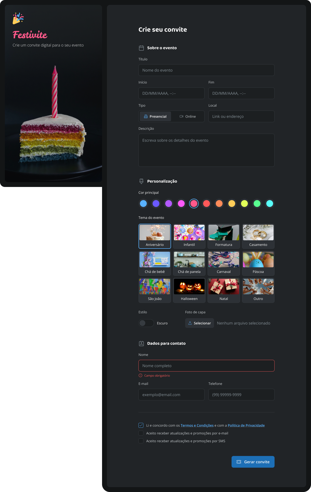

<h1 align="center">
  ✉️ Desafio - Formulário de Convite
</h1>

Este projeto é o resultado de um desafio de design concluído com sucesso, cujo objetivo era criar um formulário de convite funcional e esteticamente agradável. Desenvolvido no Figma, o layout foca em simplicidade, legibilidade e boa experiência do usuário..

  <a href="#-tecnologias">Tecnologias</a>&nbsp;&nbsp;&nbsp;|&nbsp;&nbsp;&nbsp;
  <a href="#-projeto">Projeto</a>&nbsp;&nbsp;&nbsp;|&nbsp;&nbsp;&nbsp;
  <a href="#memo-licença">Licença</a>

 

  

## 🚀 Tecnologias

Esse projeto foi desenvolvido com as seguintes tecnologias:

- HTML
- CSS

